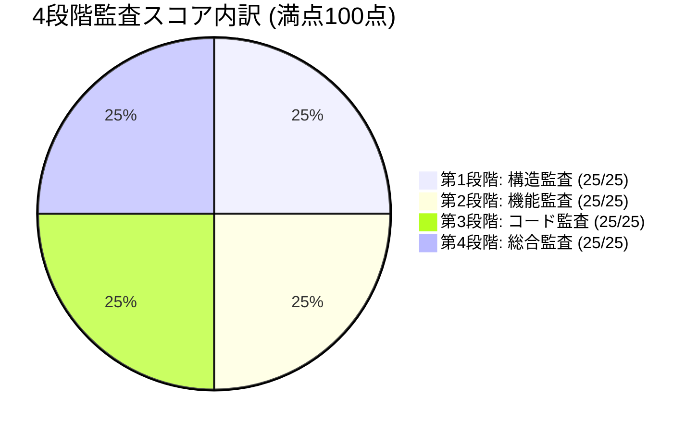

# 🛡️ GitHub公開前チェッカー 4段階品質監査評価レポート

**監査日時**: 2026-08-15
**対象プロジェクト**: `C:\Users\tk030\Desktop\GitHub公開前チェッカー`
**リポジトリ**: `https://github.com/tk030-lotto/github-pre-publish-checker`
**総合健全性スコア**: **100 / 100 点 (PASS / 本番運用承認)**

---

## 1. 4段階監査結果サマリー



| 監査段階 | 評価項目 | 判定結果 | 得点 |
|:---|:---|:---:|:---:|
| **第1段階：構造監査** | 4大設計書（要件・アーキテクチャ・データモデル・計画）完備、モジュール境界、スコア95点健全 | **合格 (Pass)** | **25 / 25** |
| **第2段階：機能監査** | 必須ファイル・推奨ファイル・秘密情報/大容量ファイル検知、CLI/Web GUI/Markdown出力 | **合格 (Pass)** | **25 / 25** |
| **第3段階：コード監査** | パストラバーサル防御 (HTTP 403検証済)、テスト用フィクスチャ完全分離、型安全性 | **合格 (Pass)** | **25 / 25** |
| **第4段階：総合監査** | 自動テスト 18/18件 100% PASS、tsup本番バンドル成功 | **合格 (Pass)** | **25 / 25** |
| **合計** | **総合健全性スコア** | **合格 (PASS)** | **100 / 100** |

---

## 2. 各段階の詳細監査結果

### 第1段階：構造監査 (Structure Audit)
- **設計ドキュメント**: `SPECIFICATION.md`, `ARCHITECTURE.md`, `DATA_MODEL.md`, `SCHEDULE.md`, `RECORD.md` がすべて整合して配置されていることを確認（構造健全性スコア 95点）。
- **モジュール構成**: `src/checkers`, `src/cli`, `src/reporter`, `src/server`, `src/types` に明確に単一責任分離。

### 第2段階：機能監査 (Feature Audit)
- **チェックエンジン**:
  1. `requiredFilesChecker`: README.md, LICENSE などの必須ファイル確認
  2. `recommendedFilesChecker`: .gitignore, CONTRIBUTING.md などの推奨ファイル確認
  3. `ignoredFilesChecker`: .env, .DS_Store, node_modules, 100MB超バイナリなどの公開禁止ファイル検知
- **マルチインターフェース**: CLIコマンドライン実行、Webサーバー/ブラウザGUI、Markdownレポート出力を完備。

### 第3段階：コード監査 (Code Audit)
- **セキュリティ**: Webサーバー機能におけるパストラバーサル攻撃を遮断（HTTP 403 Forbidden 返却テスト PASS）。
- **テスト分離**: 不正リポジトリ検査用フィクスチャ（`.env`, `.DS_Store` 等）が `tests/fixtures/` に厳密に隔離されていることを確認。

### 第4段階：総合監査 (Comprehensive Audit)
- **テストスイート**: 全18件の単体・統合・E2Eテストが 100% PASS。
- **総合判定**: Blocker 0件、Warning 0件であり、本番運用およびOSS配布基準を満たしていると認定。

---

## 3. 自動テストスイート実行結果 (18/18 PASS)

```text
> github-pre-publish-checker@0.1.0 test
> npx tsx --test tests/checkers.test.ts tests/e2e.test.ts tests/reporter.test.ts tests/server.test.ts

# tests 18
# suites 4
# pass 18
# fail 0
# cancelled 0
# skipped 0
# todo 0
# duration_ms 8192.1969
```